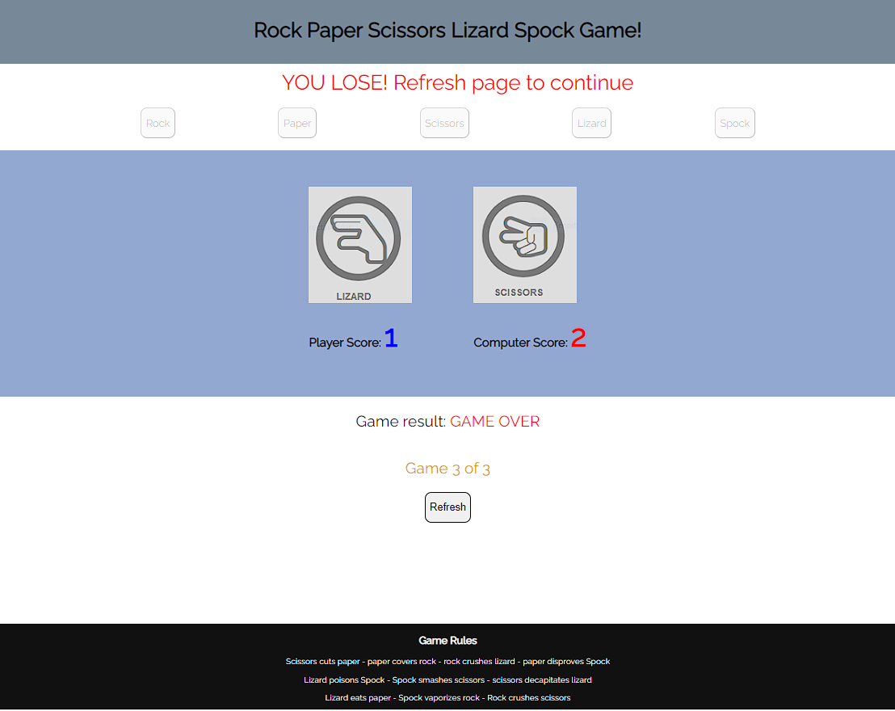

# Rock Paper Scissors Lizard Spock Game
The goal of this webpage is to enable a player to play Rock Paper Scissors Lizard Spock against a computer. RPSLS is a game of chance whereby a player selects an option and then plays against a random selection made by the computer. The creation of the game is attributed to Sam Kass and Karen Bryla. The game was famously used in the TV series 'The Big Bang Theory' to settle a dispute about what to watch on TV between Sheldon and Raj in the episode "The Lizard-Spock Expansion". 

## Site Features
The game is played on a single webpage. On accessing the webpage the player is presented with the game play area and a series of buttons. Each button represents Rock - Paper etc. The page consists of a header, beneath the header is a message area, this message area informs the player to make a choice / selection by clicking on one of the game play buttons. When the user hovers over a game play button the colour of the button and associated text changes to provide feedback to the player confirming their choice. The game play area also consists of 2 images , the default image is the same for both the player and computer at game start. The player score and computer score are set to 0. Below the game play area is a message area which tells the player who has won each individual play, this area is blank at game start. Beneath the message area is another message area which informs the player how the game is progressing with respect to the standard 'Best of 3' game play. This area is set to 0 of 3 at start up. Finally there is a footer that displays the rules of the game to the player. Finally, a refresh button is provided which enables the player to restart the game at any point - note, pressing refresh on the browser achieves the same result. 

Once the player clicks / selects an option the Game starts and the various score area update. At the end of the game ( when 3 valid games - no ties have occurred  ) a winning message is displayed , the palyer buttons are disabled and the player can then either click the Refresh button on screen or the refresh button on ht ebrowser to restart the game.

## Game Play 
## Future Enhancements
## Testing
### Bugs
### Validator Testing
## Deployment
## Credits
https://bigbangtheory.fandom.com/wiki/Rock,_Paper,_Scissors,_Lizard,_Spock 

The Lato font type was found on https://fonts.googleapis.com/css2?family=Lato:ital,wght@0,400;1,300&family=Oswald&display=swap 